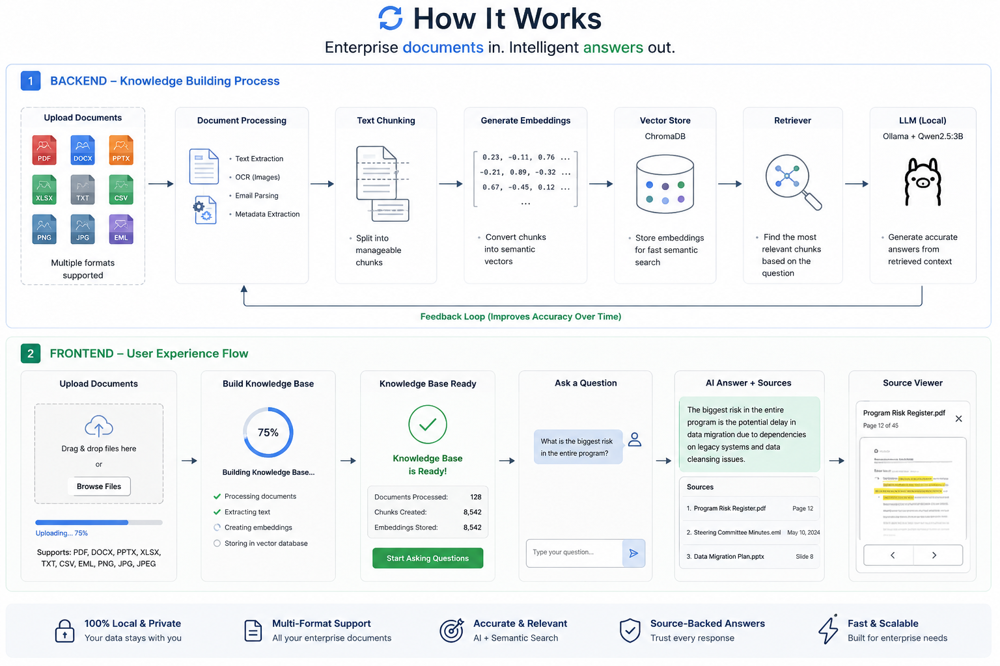
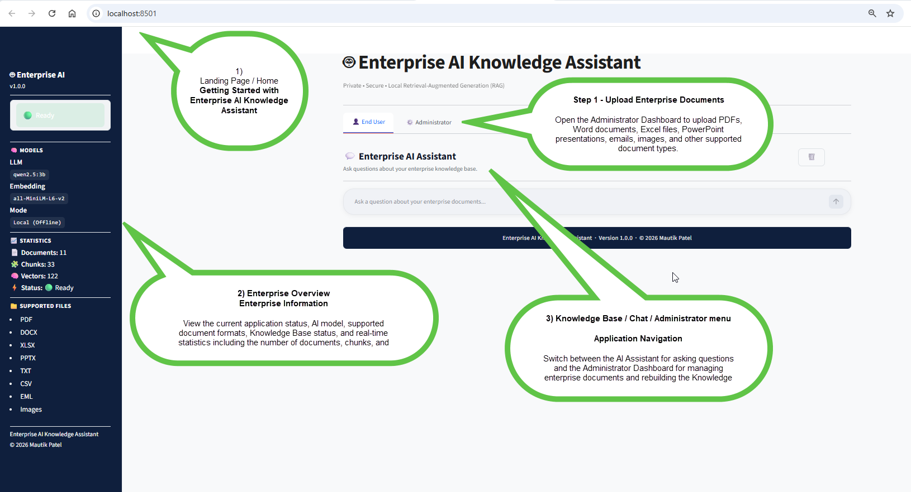
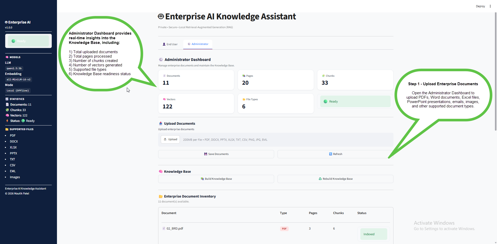
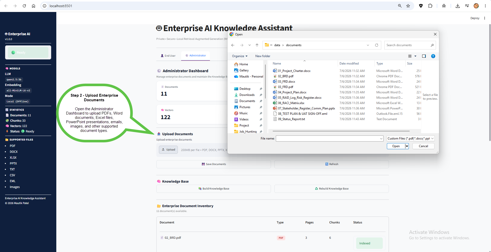
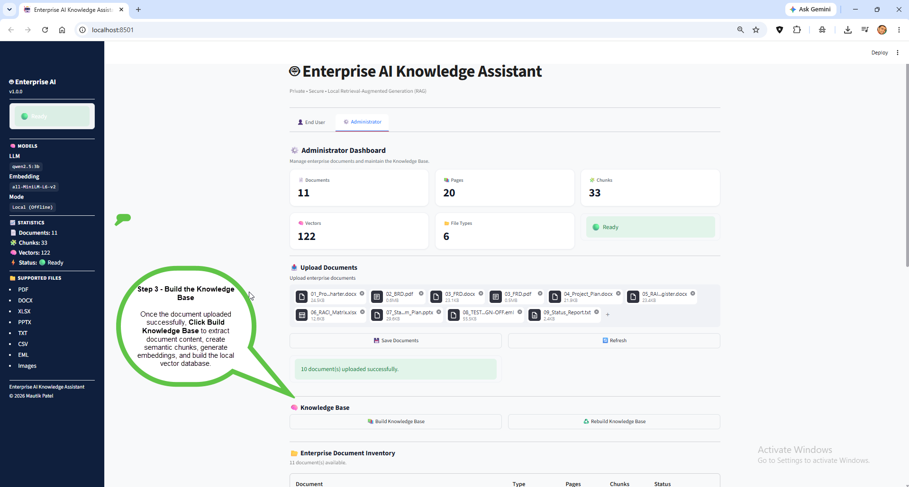
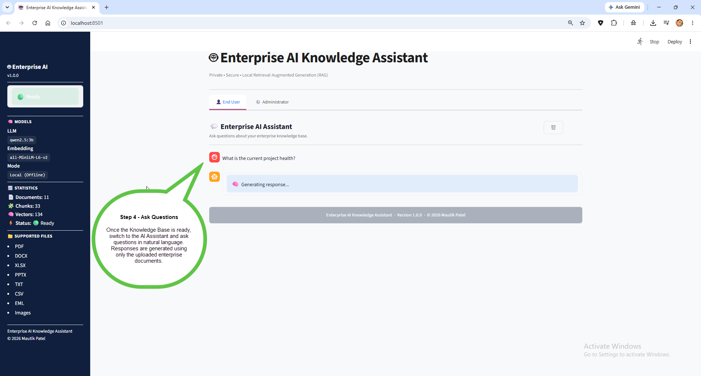
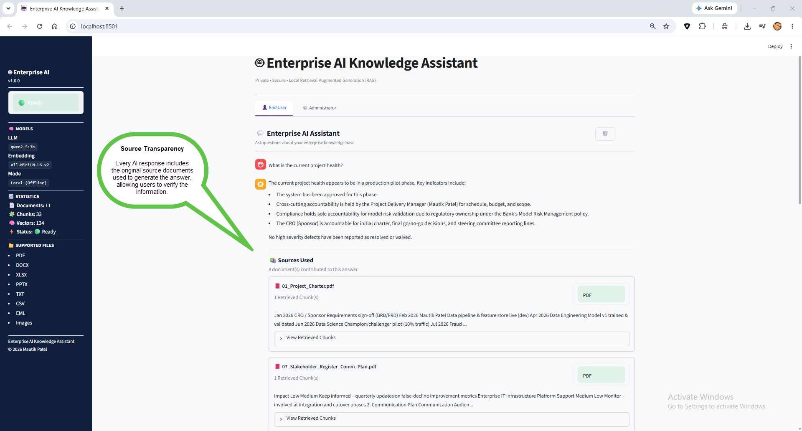
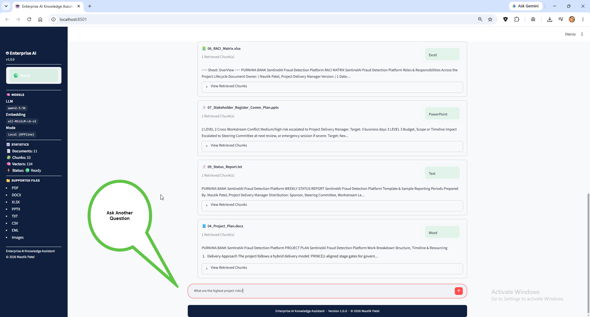
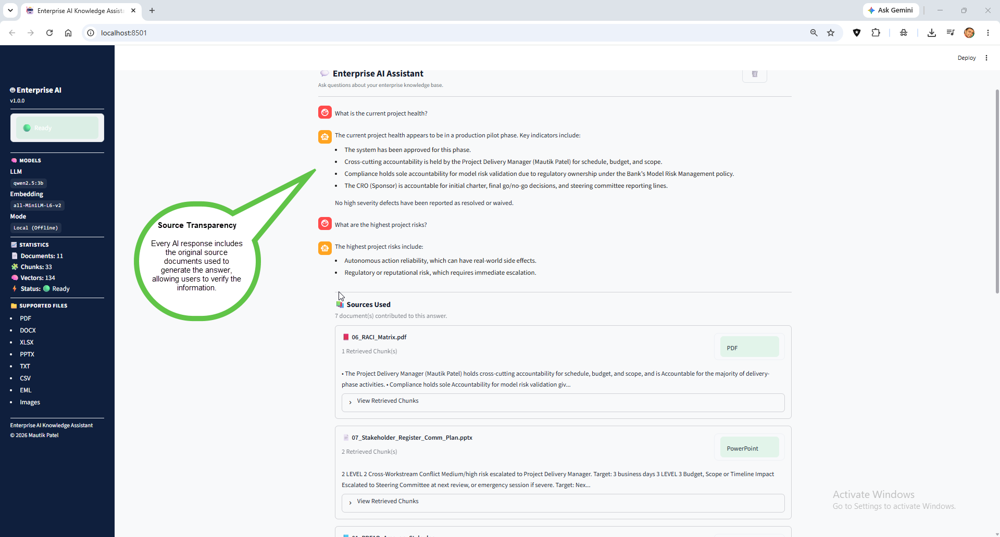

<div align="left">

# 🤖 Enterprise AI Knowledge Assistant

### Transform Enterprise Documents into Intelligent Conversations

**A private, secure, and fully local Retrieval-Augmented Generation (RAG) platform that enables organizations to search, understand, and interact with enterprise knowledge using AI.**

Enterprise AI Knowledge Assistant is a **private Retrieval-Augmented Generation (RAG)** platform that transforms enterprise documents into an intelligent, searchable knowledge base. Instead of manually searching PDFs, emails, presentations, spreadsheets, policies, and reports, users simply ask questions in natural language and receive accurate, source-backed answers - powered entirely by **local AI**.

---

### 🔒 100% Local • 🔐 Private • 🧠 AI Powered • ⚡ Enterprise Ready

<br>

   
 


<br>

> **From project documentation and company policies to healthcare protocols, compliance manuals, emails, and technical documentation — upload your enterprise knowledge once and let AI answer your questions instantly.**

</div>

---

## ⭐ Why Enterprise AI Knowledge Assistant?

Modern organizations generate thousands of documents throughout their daily operations.

Finding the right information often requires manually searching through PDFs, Word documents, Excel files, PowerPoint presentations, emails, meeting notes, policies, and screenshots.

Enterprise AI Knowledge Assistant transforms these disconnected documents into a single intelligent knowledge platform where users simply ask questions in natural language and receive accurate, source-backed answers in seconds.

Unlike cloud-based AI solutions, everything runs **locally** using **Ollama**, ensuring your organization's sensitive information never leaves your environment.

---
# 💼 The Business Problem

Every organization depends on knowledge.

Over time, that knowledge becomes scattered across hundreds or even thousands of documents created by different teams, departments, and stakeholders.

A typical enterprise may have:
|  |  | | |
|----------|-------------------|----------|-------------------|
| 📄 Project documentation | 📑 Company policies and procedures | 📊 Business reports and dashboards | 📋 Standard Operating Procedures (SOPs)
| 📈 Requirement specifications |📧 Email conversations and approvals |🧪 Testing documents and sign-offs |🖼 Screenshots of production issues
| 📽 Client presentations | 📚 User manuals and training guides |⚖️ Compliance and regulatory documentation | 📂 Contracts and legal documents

As organizations grow, finding the right information becomes increasingly difficult.

Employees often spend valuable time opening multiple files, searching emails, reviewing presentations, or asking colleagues for information that already exists somewhere within the organization.

---

# Real-World Use Cases

| Industry | Example Questions |
|----------|-------------------|
| **Project Management** | What is the current project health? What are the highest risks? Are we on track? |
| **Human Resources** | What is the leave policy? What employee benefits are available? |
| **Healthcare** | Explain the patient discharge process. What is the medication policy? |
| **Banking & Finance** | Explain the fraud detection workflow. What are the KYC requirements? |
| **Manufacturing** | Show the maintenance procedure. What caused the last production issue? |
| **Legal & Compliance** | Summarize company policies. Which document approved this change? |

---
# 🚀 The Solution

Enterprise AI Knowledge Assistant transforms disconnected enterprise documents into a single intelligent knowledge platform powered by Artificial Intelligence.

Instead of manually searching through folders, PDFs, emails, presentations, policies, or meeting notes, users simply ask questions in natural language—just as they would ask a colleague.

The platform retrieves the most relevant information from your uploaded documents and generates accurate, context-aware answers backed by source citations.

---

## 💼 Business Value

Organizations can use Enterprise AI Knowledge Assistant to:

| Business Benefit | Value |
|------------------|-------|
| ⏱ Save Time | Reduce hours spent searching documents |
| 📚 Preserve Knowledge | Capture organizational knowledge in one place |
| 🚀 Improve Productivity | Get answers instantly instead of opening multiple files |
| 🎯 Better Decisions | Access accurate, source-backed information |
| 👥 Faster Onboarding | Help new employees learn company knowledge quickly |
| 🔐 Secure AI Adoption | Keep enterprise data private with fully local AI |

---




| Landing page | Admin Page |
| :---: | :---: |
|  |  |

| Upload Document | Build Knowledge Base |
| :---: | :---: |
|  |  |

| Ask Questiion | Response With Source |
| :---: | :---: |
|  |  |

| Ask Questiion | Response With Source |
| :---: | :---: |
|  |  |


---

## 💡 From Hours of Searching to Seconds of Answers

Instead of searching manually:

```text
📂 Open Folder
      ↓
📄 Open PDF
      ↓
🔍 Search Keywords
      ↓
❌ Wrong Document
      ↓
📄 Open Another File
      ↓
📧 Search Email
      ↓
📊 Review Presentation
      ↓
🕒 Repeat...
```

Users simply ask:

> **"What is the biggest project risk?"**

> **"Are we currently on track?"**

> **"Summarize the overall project health."**

> **"Who approved this functionality?"**

> **"Where is the deployment process documented?"**

> **"Explain how this production issue was resolved."**

> **"What is our company's remote work policy?"**

> **"How many days of maternity leave are employees entitled to?"**

> **"Which SOP describes this manufacturing process?"**

> **"What are the fraud detection thresholds?"**

The assistant searches the entire knowledge base, retrieves the most relevant information, and provides a concise answer supported by the original source documents.

---

## 🎯 Why This Approach Matters

Unlike traditional keyword search, Enterprise AI Knowledge Assistant uses **semantic search**.

This means users don't need to know the exact document name or wording.

For example, if a document contains:

> *"Application availability remains within acceptable service levels."*

A user can ask:

> **"Is the system healthy?"**

or

> **"How is the application's health?"**

Even though those exact words may not appear in the document, the platform understands the meaning of the question and retrieves the relevant content.

This significantly improves information discovery across large document collections where terminology often varies between teams, departments, or authors.

---

## 🔒 Enterprise-First Design

Enterprise AI Knowledge Assistant was designed with privacy and security as core principles.

- 🔒 Documents never leave your environment.
- 💻 Runs entirely on your local machine.
- 🌐 No cloud AI services required.
- 📁 Your knowledge base remains private.
- 🤖 Powered by locally hosted Large Language Models using Ollama.

This makes the platform suitable for organizations that need intelligent document search while maintaining complete control over sensitive information.

---
# 🌍 Real-World Enterprise Use Cases

Enterprise AI Knowledge Assistant is designed as a **generic Enterprise Knowledge Platform**, making it applicable across industries and departments.

Whether the knowledge is stored in project documents, company policies, healthcare protocols, emails, contracts, or operational manuals, the platform transforms disconnected information into an intelligent, searchable knowledge base.

Simply upload your organization's documents once, build the Knowledge Base, and start asking questions in natural language.

---

| Department / Domain | Typical Documents & Artifacts | Common Internal Questions |
| :--- | :--- | :--- |
| **📋 Project & Program Management** | • Project Charters<br>• BRDs & Functional Specs<br>• RAID Logs & Risk Registers<br>• Status Reports & Minutes<br>• SteerCo Presentations<br>• UAT Sign-offs & Email Approvals<br>• Deployment & Support Guides | • What is the overall project health?<br>• Are we on track for milestones?<br>• What are the highest project risks?<br>• Which stakeholder approved Feature X?<br>• What issues / action items are open?<br>• How was Production Issue #104 resolved?<br>• Where is the deployment checklist? |
| **🏢 Human Resources & Policies** | • Employee Handbook<br>• HR & Leave Policies<br>• Travel & Expense Guidelines<br>• Benefits Documentation<br>• InfoSec & IT Asset Policies<br>• Code of Conduct<br>• Remote Work Policies | • What is the maternity leave policy?<br>• Can employees work remotely?<br>• What expenses are reimbursable?<br>• What is the required notice period?<br>• How do I request a new laptop?<br>• What is the password policy?<br>• Where is the code of conduct? |
| **🏥 Healthcare & Clinical Ops** | • Clinical Guidelines<br>• Hospital SOPs<br>• Patient Care Procedures<br>• Discharge Protocols<br>• Quality Manuals<br>• Regulatory Docs & Equipment Manuals | • Explain the patient discharge workflow.<br>• What is the sepsis treatment protocol?<br>• Which department owns this process?<br>• What is the ICU admission criteria?<br>• Summarize medication reconciliation. |
| **💰 Banking, Finance & Compliance** | • AML Policies & KYC Procedures<br>• Internal Audit Reports<br>• Fraud Detection Rules<br>• Risk Frameworks<br>• Regulatory Guidelines | • What are fraud detection thresholds?<br>• Explain the KYC onboarding process.<br>• What controls are needed for AML?<br>• Who approves high-risk transactions?<br>• Summarize the latest audit findings. |
| **🏭 Manufacturing & Operations** | • Standard Operating Procedures (SOPs)<br>• Maintenance & Equipment Manuals<br>• Safety Procedures<br>• Quality Standards<br>• Troubleshooting Guides | • What caused the production outage?<br>• Which maintenance applies to Machine A?<br>• What safety checks are run before startup?<br>• Show troubleshooting for Error Code 205. |
| **⚖️ Legal & Contract Management** | • Vendor Contracts<br>• Non-Disclosure Agreements (NDAs)<br>• Compliance Records<br>• Service Level Agreements (SLAs)<br>• Partnership Agreements | • Which contract contains this clause?<br>• When does Vendor ABC's contract expire?<br>• What are the core payment terms?<br>• Which NDA covers Customer XYZ?<br>• Summarize all contractual obligations. |
| **🎓 Training & Knowledge Base** | • Product Documentation<br>• Training Manuals<br>• Knowledge Base (KB) Articles<br>• Technical & Architecture Guides<br>• Employee Onboarding Material | • Explain how Feature X works.<br>• Summarize the deployment process.<br>• Where is the troubleshooting guide?<br>• What are our coding standards?<br>• Which document explains architecture? |

---

## 🚀 One Platform. Unlimited Possibilities.

Enterprise AI Knowledge Assistant is not limited to a specific industry, department, or document type.

Any organization with a growing collection of documents can transform static information into an intelligent AI-powered knowledge platform while maintaining complete control over sensitive data through fully local deployment.

Instead of searching through files, employees simply ask questions—and receive accurate, source-backed answers in seconds.

# ✨ Enterprise Capabilities

Enterprise AI Knowledge Assistant combines Artificial Intelligence, semantic search, and enterprise document management into a single intelligent platform.

<table>
<tr>

<td width="50%" valign="top">

## 🤖 AI Enterprise Search

Ask questions naturally instead of manually searching hundreds of enterprise documents.

**Key Capabilities**

- Semantic AI Search
- Context-aware Answers
- Local LLM (Qwen2.5)
- Source-backed Responses
- Natural Language Questions

</td>

<td width="50%" valign="top">

## 📚 Intelligent Knowledge Base

Transform disconnected enterprise documents into one searchable AI-powered knowledge repository.

**Key Capabilities**

- Document Upload
- Automatic Chunking
- Embedding Generation
- ChromaDB Indexing
- Fast Retrieval

</td>

</tr>

<tr>

<td width="50%" valign="top">

## 🔍 Semantic Search

Find information based on meaning instead of exact keywords.

Example

**Document**

> "Application availability remains within acceptable service levels."

**User asks**

> "Is the application healthy?"

The platform understands both represent the same concept.

</td>

<td width="50%" valign="top">

## 📄 Multi-Format Support

Supports enterprise knowledge stored in multiple document formats.

**Supported Formats**

PDF • DOCX • PPTX • XLSX • TXT • CSV • EML • PNG • JPG • JPEG

OCR automatically extracts text from supported image documents.

</td>

</tr>

<tr>

<td width="50%" valign="top">

## 📑 Source Transparency

Every AI response includes supporting source documents.

Users can:

- Verify information
- Review original content
- Increase trust
- Navigate back to source documents

No black-box AI responses.

</td>

<td width="50%" valign="top">

## ⚙️ Administrator Dashboard

Complete Knowledge Base management.

**Features**

- Upload Documents
- Build Knowledge Base
- Rebuild Vector Database
- Document Statistics
- Knowledge Status
- Inventory Management

</td>

</tr>

<tr>

<td width="50%" valign="top">

## 🔒 Privacy First

Enterprise security by design.

✔ Runs Completely Offline

✔ Local AI Models

✔ No Cloud APIs

✔ No Data Leaves Your Machine

✔ Suitable for Confidential Enterprise Data

</td>

<td width="50%" valign="top">

## 🏗 Enterprise Architecture

Designed using modular services for maintainability and scalability.

**Architecture Includes**

- Document Processing
- Chunking Service
- Embedding Service
- Vector Store
- Retriever
- Local LLM
- Streamlit UI

</td>

</tr>

</table>

---

# 🛠 Technical Stack & Engineering Highlights

| Layer | Technologies | Business Impact |
|-------|--------------|-----------------|
| **Programming Language** | Python | Rapid development of scalable AI and data processing pipelines |
| **User Interface** | Streamlit | Interactive web application with Administrator and AI Chat interfaces |
| **Large Language Model (LLM)** | Ollama, Qwen2.5:3B | Fully local AI inference with no cloud dependency, ensuring data privacy |
| **Retrieval-Augmented Generation (RAG)** | Semantic Retrieval + Context Injection | Delivers accurate, context-aware responses grounded in enterprise documents |
| **Vector Database** | ChromaDB | High-performance semantic search across thousands of document chunks |
| **Embedding Model** | Sentence Transformers | Converts enterprise documents into semantic vector representations for intelligent retrieval |
| **Document Chunking** | LangChain Text Splitter | Optimizes document segmentation for improved retrieval accuracy and LLM context management |
| **Document Processing** | PyMuPDF, python-docx, python-pptx | Extracts structured content from PDFs, Word documents, and PowerPoint presentations |
| **Spreadsheet Processing** | Pandas, OpenPyXL | Reads and processes structured Excel and CSV datasets |
| **OCR Engine** | Tesseract OCR, Pillow | Extracts text from scanned documents and image-based files |
| **Knowledge Base Pipeline** | Custom Python Services | Automates document ingestion, preprocessing, embedding generation, and vector indexing |
| **Application Architecture** | Modular Service-Oriented Design | Promotes maintainability, scalability, and separation of concerns |
| **Session Management** | Streamlit Session State | Maintains application state, chat history, and Knowledge Base status |
| **Version Control** | Git, GitHub | Source control, collaboration, and portfolio showcase |


---

# 👨‍💻 About the Author

## Mautik Patel

**Enterprise Data, Analytics & AI Transformation Professional**

Passionate about transforming complex business data into meaningful insights through modern Business Intelligence, Analytics, and AI-driven solutions. With expertise spanning healthcare, enterprise reporting, and executive analytics, I design scalable, data-driven solutions that enable organizations to make informed strategic decisions.

### 💼 Areas of Expertise

- 📊 Enterprise Business Intelligence Solutions
- 📈 Microsoft Power BI & Executive Dashboard Design
- 🧠 DAX & Advanced Data Modeling
- 🔄 Power Query (ETL) & Data Transformation
- 🗄️ SQL Server & Data Warehousing
- 🏥 Healthcare Analytics & KPI Reporting
- 📐 Star Schema & Semantic Model Design
- ⚙️ Enterprise ETL Development
- 🤖 AI-Driven Analytics & Data Strategy
- ☁️ Microsoft Fabric (Currently Learning)

### 🌐 Connect

- 💼 **LinkedIn:** https://www.linkedin.com/in/mautikpatel
- 💻 **GitHub:** [*Explore more enterprise analytics and AI projects*](https://github.com/MautikPatel)

> *"Turning Data into Decisions. Turning Insights into Impact."*

---

<p align="center">

## ⭐ Thank You for Visiting

If you found this project helpful, please consider giving it a **⭐ Star** on GitHub. Your support, feedback, and suggestions are always appreciated.
<br>
### Built with ❤️ using Microsoft Power BI

**Designed & Developed by Mautik Patel**

*Enterprise Data • Analytics • AI Transformation*

🚀 *Turning Data into Decisions. Turning Insights into Impact.*

</p>

---

## 📜 License
This project is licensed under the MIT License. See the LICENSE file for details.


